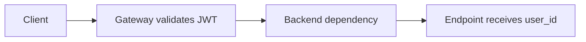

# Lesson 0002: Claim Validation and Auth Dependency Design

**Goal:** Keep the backend auth dependency small while still validating the parts of the request that remain the backend's responsibility.

## Core Idea
Gateway-trust means the backend does not repeat signature verification, but it still validates the request shape and the identity claim it depends on.

## Core Diagram

## Key Steps

1. Validate the `Authorization` header format.
2. Decode the JWT payload without signature verification.
3. Require the `UserId` claim and reject missing or malformed values.
4. Decode the HashId into a numeric user ID.
5. Return only the clean identity value to route handlers.

## Design Principles
- Fail closed when the token or claim structure is wrong.
- Avoid defaults in auth code.
- Keep extraction, decoding, and validation in one dependency.
- Override the dependency in tests rather than patching route internals.

## Failure Modes
- Missing `Authorization` header.
- Non-bearer token formats.
- Missing `UserId` claim.
- HashId config drift.
- Silent fallback identities.

## Related Pages
- [[jwt_gateway_trust_pattern]]
- [[jwt_glossary]]
- [[hashid_identity_pattern]]
- [[fastapi_dependency_auth]]

## Full Lesson
See HTML version: `lessons/0002_claim_validation_and_auth_dependency.html`
