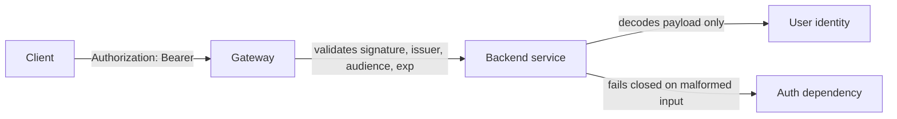

# JWT Gateway Trust Pattern

## Overview
An authentication pattern where a backend service trusts the API gateway's JWT validation and extracts identity from the token without verifying the signature itself.

## Flow

```
Client → Gateway (validates JWT signature, expiry, audience)
       → Backend Service (extracts identity, skips signature check)
```

## Core Diagram


## Key Properties
- Gateway owns cryptographic verification and token admission.
- Backend service decodes the JWT payload without verifying the signature.
- Trust boundary is the private network path between gateway and backend.
- Backend may still validate required claims and schema for defense in depth.

## When to Use
- Internal microservices behind a trusted gateway.
- Gateway already validates tokens for all routes.
- Backend needs user identity but not independent cryptographic assurance.

## When NOT to Use
- Public-facing APIs without a gateway.
- Services that receive tokens directly from clients.
- Zero-trust architectures where network boundary is not trusted.

## Security Considerations
- Any principal that can reach the backend directly can forge JWTs.
- Mitigate with network policies, service mesh enforcement, and mTLS where applicable.
- Keep minimal validation in the backend: token shape, required claims, and claim types.
- Treat the pattern as an internal trust shortcut, not a substitute for authorization.

## Related
- [[jwt_glossary]]
- [[hashid_identity_pattern]]
- [[fastapi_dependency_auth]]
